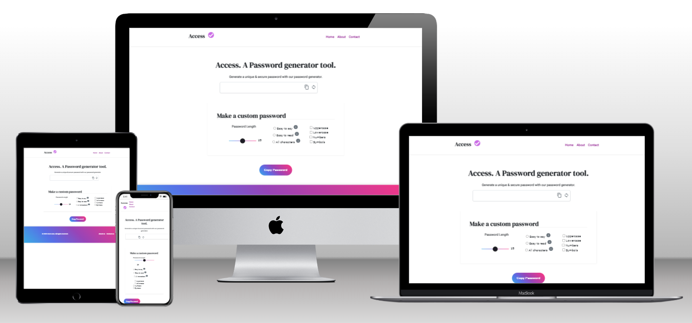

# Password Creator

> A password generator that generates random &amp; unique passwords for those trying to find one.

## Built With

- HTML5
- CSS3
- Bootstrap
- JavaScript
- Webpack
- Git

## Preview



## Live Demo

[Live Demo Link from ./dist/index.html](https://raw.githack.com/chelmerrox/password-creator/page_structure/dist/index.html)

## Getting Started

To get a local copy up and running follow these simple example steps.

### Prerequisites

- HTML5 & CSS3 
- JavaScript
- Webpack
- VSCode (or any other text editor)
- Git
- GitHub
- Command line/Terminal

### Setup

From the command line, do the following steps below:

1. Clone the projects' repository into your machine.

```bash
# Clone this repository
$ git clone git@github.com:chelmerrox/password-creator.git

```
2. Change directory/Go into the repository with the command below.

```bash
$ cd password-creator

```

3. Run this command.

```bash
$ npm run build

```

4. Run this to deploy the site on your local machine.

```bash
$ npm start

```

## Author

👤 **Losalini Rokocakau**

- GitHub: [@chelmerrox](https://github.com/chelmerrox)
- Twitter: [@chelmerrox](https://twitter.com/chelmerrox)
- LinkedIn: [Losalini Rokocakau](https://linkedin.com/in/losalini-rokocakau)

## Collaborators

👤 **Senitiki Rokocakau** | GitHub: [@senitiki](https://github.com/senitiki)

## 🤝 Contributing

Contributions, issues, and feature requests are welcome!

Feel free to check the [issues page](https://github.com/chelmerrox/password-creator/issues).

## Show your support

Give a ⭐️ if you like this project!

## Acknowledgments

- My God & family
- Microverse
